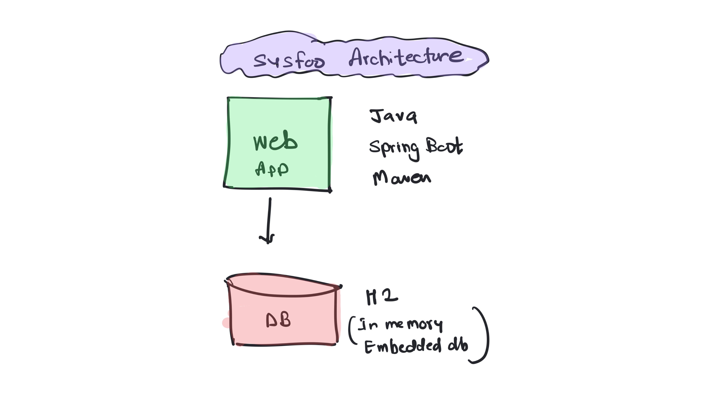
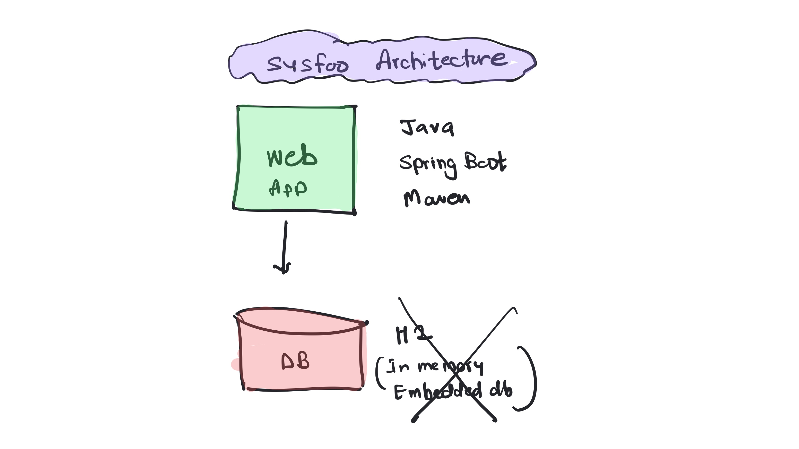
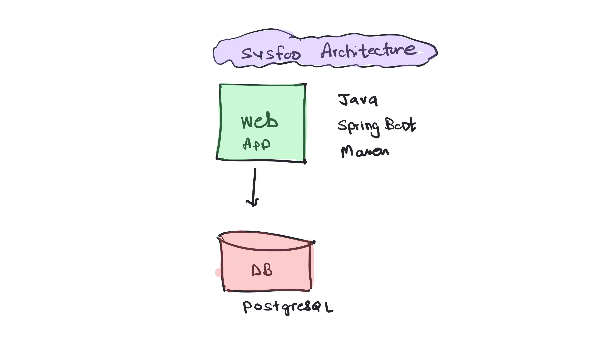

# Sysfoo Application

A Devops Learning App 

## About the Application

The Sysfoo application is designed as a learning tool to demonstrate various aspects of web development using Spring Boot and other associated technologies. It provides real-time system information, database connectivity status, and a basic to-do list functionality to illustrate interaction with a database.

This application is ideal for individuals learning about Spring Boot, RESTful services, and simple frontend interactions with JavaScript. This is also useful for anyone who would like to implement Devops Practices with this App. 



As part of devops learning you could take this app and

  * Containerize it by writing a Dockerfile 
  * Setup a dev environment with Docker Compose 
  * Build a CI Pipeline with Jenkins, Docker, Git 
  * Deploy using Kubernetes 
  * Setup Automated Devployments with ArgoCD 
  * Setup DevSecOps workflows 
  * Deploy it on Cloud and automate that with Terraform 

These are just a few ideas you could try and then build so much on top of this. 

## Building the Application

To build and run the Sysfoo application, follow these steps:

### Prerequisites

- JDK 17 or later
- Maven 3.6 or later
- An IDE of your choice (Eclipse, IntelliJ IDEA, etc.)

### Steps to Build and Launch

1. **Clone the Repository**

   Start by cloning the repository to your local machine:

```bash
   git clone https://github.com/your-username/sysfoo.git
   cd sysfoo
```

2. **Compile/Build the Application**

Use Maven to build the application:

```
  mvn clean install
```
This command compiles the application and runs any unit tests.

3. **Run Unit Tests**

To launch automated unit tests: 

```
mvn clean test 
```

4. **Package the Application**

To package this app and to generate an artifact: 

```
mvn package -DskipTests
```

5. **Launch the Application**

Once the build is successful, you can run the application:

```
java -jar target/sysfoo-0.0.1-SNAPSHOT.jar

```
Alternatively, if you are using an IDE, you can simply run the application by running the main class annotated with @SpringBootApplication.

4. **Accessing the Application**

After starting the application, you can access it at:

  * Frontpage: http://localhost:8080/ : This page displays the system and database status and includes a simple to-do list functionality.
  * Systems Status : http://localhost:8080/system-info
  * App Version : http://localhost:8080/version 
  * DB Status : http://localhost:8080/database-info 

You may have to replace `localhost` with the actual hostname or IP address based on your setup. 

Following is how the front page looks like 


## Switching to PostgreSQL Database

This application usesa embded, in memory database called H2 by default. To use PostgreSQL as the database for the Sysfoo application, you need to configure both the application properties and set up the environment appropriately. Here’s how you can switch from the default H2 database to PostgreSQL.




### Prerequisites

- PostgreSQL installed on your development machine or access to a PostgreSQL server.

### Configuration Steps

Use the following steps to activate the PostgreSQL profile. 

#### Configure Application Properties - Option 1 

Modify the application-prod.properties file in your project to include the PostgreSQL database connection settings:

e.g. 

```
# DataSource configuration for PostgreSQL
spring.datasource.url=jdbc:postgresql://localhost:5432/sysfoo
spring.datasource.username=postgres
spring.datasource.password=your_password
spring.datasource.driver-class-name=org.postgresql.Driver

# Hibernate properties
spring.jpa.properties.hibernate.dialect=org.hibernate.dialect.PostgreSQLDialect
spring.jpa.hibernate.ddl-auto=update

```

Replace localhost, sysfoo, postgres, and your_password with your actual database host, database name, username, and password.


#### Configure Application Properties - Option 2 : 

Instead of updating it in the application-prod.properties, you could directly set these from environment as: 

```
export SPRING_DATASOURCE_URL=jdbc:postgresql://db:5432/sysfoo
export SPRING_DATASOURCE_USERNAME=postgres
export SPRING_DATASOURCE_PASSWORD=postgres
```

Replace db (hostname), postgres(user) and postgres(password) with the actual values. 
 

#### Set Active Profile

To activate the PostgreSQL configuration, set the SPRING_PROFILES_ACTIVE environment variable to prod when starting your application. This can be done in your docker-compose.yml or through your IDE or terminal:

```
export SPRING_PROFILES_ACTIVE=prod
```

## Development with the Application

When developing with the Sysfoo application, consider the following tips:

  * IDE Configuration: Ensure your IDE is set up with Lombok plugin if used, and configure it to recognize Maven projects.
  * Code Style: Follow standard Java and Spring Boot coding conventions. You can configure your IDE to use these styles.
  * Adding New Features: When adding new features, write corresponding unit tests to ensure functionality works as expected and existing features remain stable.

For more detailed instructions on contributing to this project or setting up your development environment, refer to the CONTRIBUTING.md file.

## License

This project is licensed under the Apache License 2.0. For more details, see the LICENSE file in the root directory of this project or visit [Apache License 2.0](https://www.apache.org/licenses/LICENSE-2.0).

## Reporting Issues

If you encounter any issues while using or developing the Sysfoo application, please file an issue on the project's GitHub issue tracker. Include detailed information about the problem to help reproduce and resolve the issue efficiently.


We hope you find the Sysfoo application useful for learning and developing your skills in Spring Boot and web application development!


